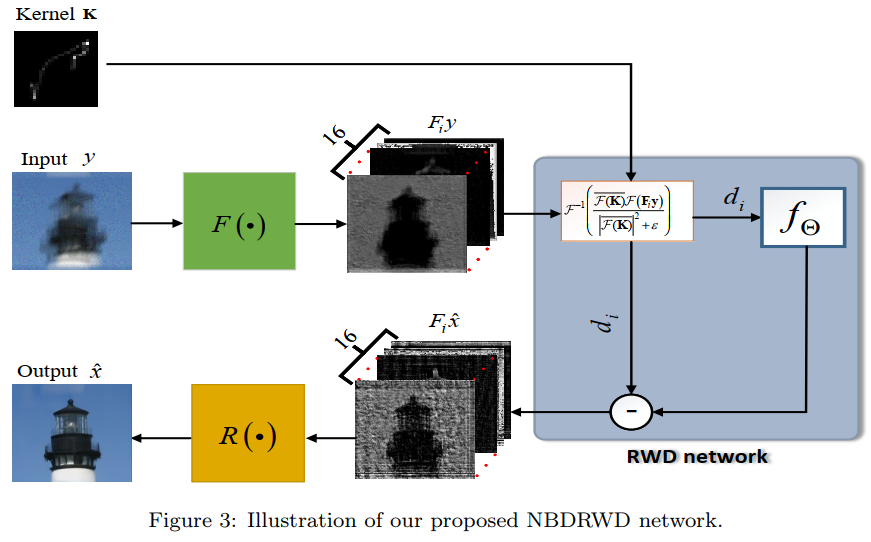
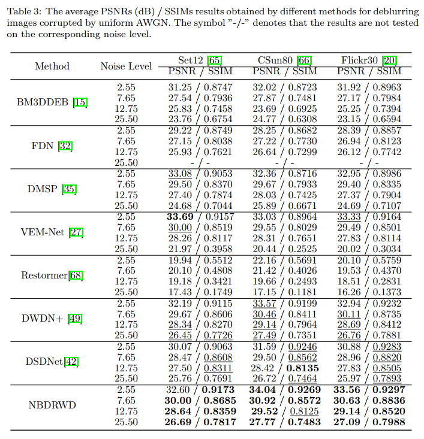
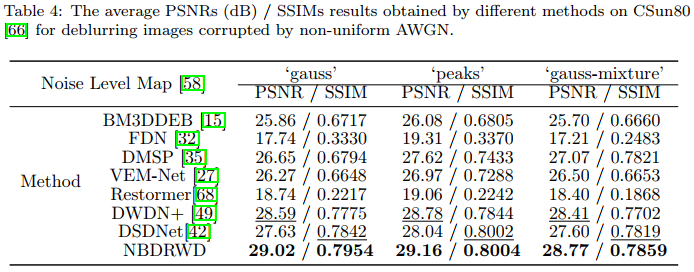

# Noise Blind Deep Residual Wiener Deconvolution Network for Image Deblurring 

This repository is the PyTorch implementation of the work:

**Noise Blind Deep Residual Wiener Deconvolution Network for Image Deblurring **

Shengjiang Kong, Weiwei Wang, Xiangchu Feng, Xixi Jia

To will appear at **[DSP](https://www.sciencedirect.com/journal/digital-signal-processing) (Digital Signal Processing)**

## Introduction

The Deep Wiener Deconvolution Network (DWDN) provides a simple and effective approach for non-blind image deblurring by performing the classical Wiener filtering in deep feature domain. However, it needs estimation of signal-to-noise ratio (SNR), which is obtained under the uniform Gaussian noise assumption. This paper presents the Residual Wiener Deconvolution (RWD) network, which reformulates Wiener deconvolution into two successive operations: deconvolution and denoising. To avoid explicit estimation of SNR, the denoising operation is parameterized by a network, in which the SNR is estimated. The RWD network is then combined with the encoding/decoding network of DWDN+, resulting in an end-to-end trainable model called Noise Blind Deep Residual Wiener Deconvolution (NBDRWD) network. Experimental results show that, the proposed NBDRWD significantly outperforms related baselines in deblurring images corrupted by uniform Gaussian noise, non-uniform Gaussian noise, JPEG compression artifacts, and real blur.



## Requirements

Compatible with Python 3

Main requirements: PyTorch 1.7.1 or 1.12 are tested

To install requirements:

```shell
pip install torch==1.7.1 torchvision==0.8.2
pip install -r requirements.txt
```

## Evaluation

To evaluate/train the Noise Blind Deep Residual Wiener Deconvolution Network, run:

```
git clone https://github.com/kongsjsj/NBDRWD.git
```

- Training with `DataParallel` - PSNR

  You should modify the parameter `is_train=true`from `configs/traincolor.json` and modify the parameter`model_select=NBDRWD or model_select=NBDRWD_JPEG`.

```shell
python deblurring.py
```

- Testing NBDRWD for synthesized data with uniform AWGN

  You should modify the parameter `is_train=false`from `configs/traincolor.json` and `is_test_gauss=true,is_test_nonuniform=false, test_noise_level=2.55|7.65|12.75|25.5' `from`configs/test_simulated.json` to produce the results in Table3.

```shell
python deblurring.py
```



- Testing NBDRWD for synthesized data with non-uniform AWGN

  You should modify the parameter `is_train=false`from `configs/traincolor.json` and `is_test_gauss=false,is_test_nonuniform=true | sigma_map_type='gauss'or'peaks'or'gauss-mix' `from`configs/test_simulated.json` to produce the results in Table4.

  

```shell
python deblurring.py
```

- Testing NBDRWD for real-world blurry data

  You should modify the parameter `is_train=false`from `configs/traincolor.json` and `is_test_real=true | root_path='./dataset/test_data', test_data=Pandata or Kohlerdata, kernel_path=./dataset/PandataKernels or ./dataset/KohlerdataKernels `from`configs/test_realworld.json` to produce the visual results in Figures 13 and 14.

## Pre-trained Model

Please download the model from https://drive.google.com/drive/folders/1TOL2Hz8nnejPHP-1ZlKGyDTIPrwxQx4E?usp=drive_link and put it in the folder "./pretrainedmodels/".

| Model                                                        | # params | Remark                                                       |
| ------------------------------------------------------------ | -------- | ------------------------------------------------------------ |
| [NBDRWD](https://drive.google.com/file/d/1USEcGF8yJEqst5zi4rbBK1nBLVSdSzey/view?usp=drive_link) | 246.3M   | Deblurring images with uniform or non-uniform AWGN           |
| [NBDRWD_JPEG](https://drive.google.com/file/d/19Y7O_P8w7RIIlVJXz97hNDXE0gwxDHTF/view?usp=drive_link) | 246.3M   | Deblurring images with JPEG compression distortion           |
| [DWDNPlus](https://drive.google.com/file/d/12P6iz2fS0JRNliug16p9Iff8DyGV53Uz/view?usp=drive_link) | 239.4M   | Retrained **DWDN+** model: Deblurring images with uniform or non-uniform AWGN |
| [DWDNPlus_JPEG](https://drive.google.com/file/d/1jFcwpGFb2ocGlgNk4QW9tLF_sYau_oCL/view?usp=drive_link) | 239.4M   | Retrained **DWDN+** model: Deblurring images with JPEG compression distortion |

## Test Dataset

Please download the test dataset from https://drive.google.com/drive/folders/1Btie2ZlhUU2V9XF4ExQepsJSydOYka2w?usp=drive_link and put it in the folder "./dataset/test_data/".

## Other Acknowledgment

Part of our code is based on the [KAIR](https://github.com/cszn/KAIR) and [DWDN](https://github.com/dongjxjx/dwdn). Thanks for their awesome work.

